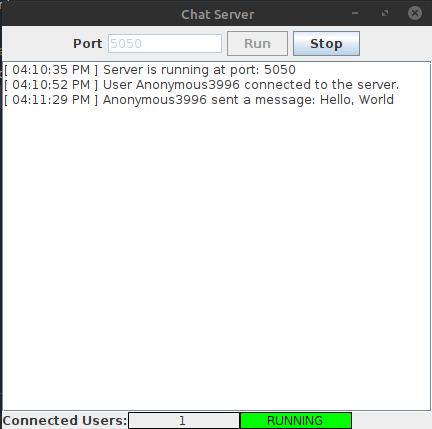
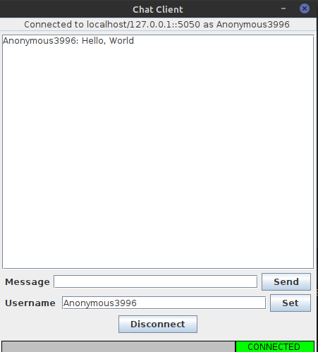

# **RealTime-Chat**
---
### Chat client and server made using JDK11 and Swing



#### Server Features:
- Multi-client support (1 thread per client)
- GUI for logging
- Run on custom port
---
<br /><br/><br/>

 
#### Client Features:
- Change username on the fly
- Informative GUI
---
<br /><br/><br/>
```
This is just a personal project that I made while learing Java. Nothing serious.
```